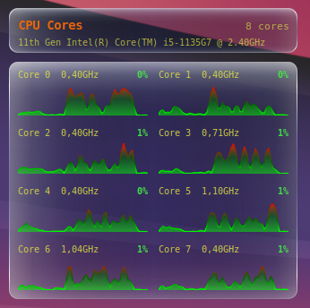

# conky-cores

A small Conky config for a per-core CPU monitor using Lua/Cairo graphics.

This project renders a clean glass-style widget that displays each logical CPU core with:

- a small rolling line graph
- current load percentage
- current frequency

The layout is automatically adjusted based on the number of cores detected at startup.



## Files

- `conky.conf` — Conky configuration file that loads `widget.lua`.
- `widget.lua` — Lua drawing code for the per-core CPU display.

## Features

- automatic core count detection using `nproc`
- two cores per row by default, with support for more rows as needed
- smooth liquid-glass styled box rendering
- configurable colors, margins, and graph history length

## Requirements

- Conky with Lua and Cairo support
- `nproc` available on the system
- Linux with `/proc/cpuinfo`

## Installation

1. Clone the repository:

   ```sh
   git clone https://github.com/your-username/conky-cores.git
   cd conky-cores
   ```

2. Run Conky from the repository directory:

   ```sh
   ./autostart.sh
   or
   conky -c ./conky.conf
   ```

3. If needed, adjust the window position and size in `conky.conf`.

## Customization

- `conky.conf` contains window layout settings such as `alignment`, `gap_x`, `gap_y`, `minimum_width`, and `minimum_height`.
- `widget.lua` contains visual and behavior options in the `CFG` table, including:
  - `cores_per_row`
  - `graph_history_length`
  - color definitions

## Notes

- The widget is designed to match the style of a companion Conky setup, but it can be used standalone.
- If your machine has more than 8 cores, you may want to increase `minimum_height` or adjust `cores_per_row`.
